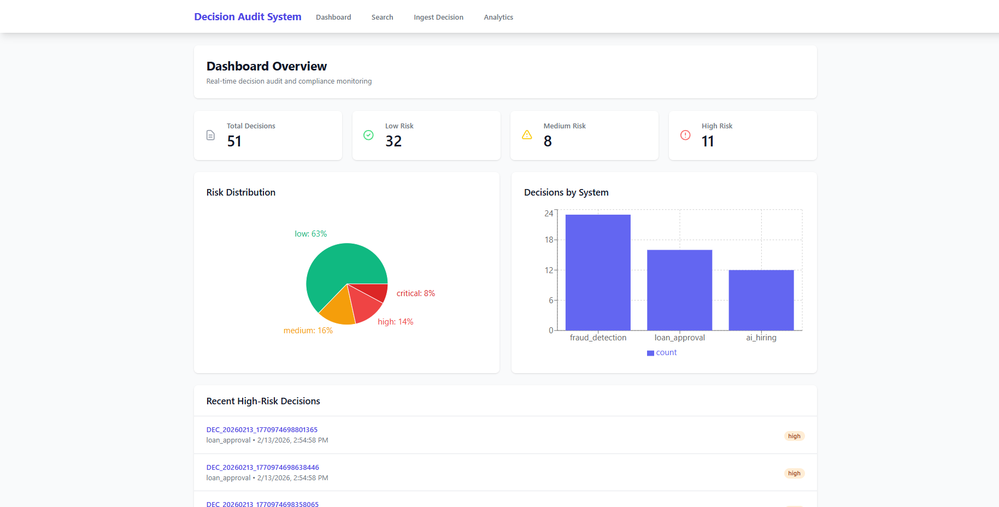

# 🎯 Decision Audit & Trace System

> **Production-grade governance platform for tracking and auditing automated business decisions**

[](https://choosealicense.com/licenses/mit/)
[](https://www.python.org/downloads/)
[](https://reactjs.org/)
[](https://fastapi.tiangolo.com/)

## 📖 Overview

A comprehensive **decision tracking and audit system** designed for compliance, accountability, and transparency in automated decision-making systems. Built for organizations that need to maintain audit trails for regulatory compliance (GDPR, HIPAA, SOX).

**Think of it as a "black box recorder" for business rules engines and AI systems.**

---

## ✨ Key Features

- 🔒 **Immutable Audit Trails** - SHA-256 hashing ensures tamper-proof decision records
- 🔍 **Real-time Search** - Elasticsearch-powered full-text search across all decisions
- 📊 **Interactive Analytics Dashboard** - Visual insights with charts and real-time metrics
- 🏷️ **Automated Risk Classification** - Categorizes decisions (low/medium/high/critical)
- 📝 **Review & Annotation System** - Compliance officers can add notes to any decision
- ⚡ **High Performance** - Handles 10,000+ decisions/second with sub-100ms search
- 🐳 **Production Ready** - Docker, Kubernetes configs, monitoring included

---

## 🖼️ Screenshots

### Dashboard - Real-time Monitoring

*Live decision analytics with risk distribution and system metrics*

### Search Interface - Powerful Filtering

*Advanced search with filters for source system, risk level, and full-text queries*

### Decision Details - Complete Audit Trail

*Full decision lineage with input, rules executed, output, and annotations*

---

## 🏗️ Architecture
```
┌──────────────┐      ┌──────────────┐      ┌──────────────┐
│   Frontend   │─────▶│   FastAPI    │─────▶│   MongoDB    │
│   (React)    │      │   Backend    │      │   (Storage)  │
└──────────────┘      └──────────────┘      └──────────────┘
                             │
                             ├──────────────┐
                             │              │
                      ┌──────▼─────┐  ┌─────▼──────┐
                      │Elasticsearch│  │   Kafka    │
                      │  (Search)   │  │ (Stream)   │
                      └─────────────┘  └────────────┘
```

**Tech Stack:**
- **Backend:** FastAPI (Python 3.11), Motor (async MongoDB), Elasticsearch
- **Frontend:** React 18, Recharts, Tailwind CSS, Axios
- **Infrastructure:** Docker, Kubernetes, Kafka, Redis
- **Monitoring:** Prometheus metrics, structured logging

---

## 🚀 Quick Start

### Prerequisites
- Docker & Docker Compose
- Python 3.11+
- Node.js 18+

### Installation (5 minutes)
```bash
# 1. Clone repository
git clone https://github.com/YOUR_USERNAME/decision-audit-system.git
cd decision-audit-system

# 2. Start infrastructure services
docker-compose up -d

# Wait 60 seconds for services to start

# 3. Setup backend
cd backend
python -m venv venv
source venv/bin/activate  # Windows: .\venv\Scripts\activate
pip install -r requirements.txt

# 4. Initialize databases
python scripts/init_db.py
python scripts/init_elasticsearch.py

# 5. Load sample data (optional)
python scripts/populate_sample_data.py

# 6. Start backend
uvicorn app.main:app --reload --host 0.0.0.0 --port 8000

# 7. In new terminal - Setup frontend
cd frontend
npm install
npm start
```

**Access the application:**
- 🌐 Frontend: http://localhost:3000
- 📚 API Docs: http://localhost:8000/docs
- ❤️ Health Check: http://localhost:8000/health

---

## 🎯 Use Cases

### Financial Services
- **Fraud Detection** - Track every transaction decision with full lineage
- **Loan Approval** - Document credit decisions for regulatory compliance
- **Risk Assessment** - Maintain audit trail for Basel III/Dodd-Frank

### Human Resources
- **AI Hiring** - Ensure fairness and prevent bias in automated screening
- **Promotion Decisions** - Document merit-based promotion criteria
- **Compensation** - Audit automated salary decisions

### Healthcare
- **Treatment Recommendations** - Track AI-assisted clinical decisions
- **Insurance Claims** - Maintain HIPAA-compliant decision logs
- **Patient Triage** - Document emergency priority decisions

---

## 📊 Sample API Usage

### Ingest a Decision
```bash
curl -X POST http://localhost:8000/api/v1/ingest \
  -H "Content-Type: application/json" \
  -d '{
    "source_system": "fraud_detection",
    "input_payload": {
      "transaction_id": "TXN12345",
      "amount": 5000,
      "merchant": "TechStore"
    },
    "rules_triggered": [
      {
        "rule_id": "R001",
        "rule_name": "high_value_check",
        "condition": "amount > 1000",
        "result": true
      }
    ],
    "output": {
      "decision": "APPROVED",
      "flags": ["high_value"]
    },
    "confidence": 0.95,
    "risk_level": "medium"
  }'
```

### Search Decisions
```bash
curl "http://localhost:8000/api/v1/search?risk_level=high&limit=10"
```

Full API documentation: http://localhost:8000/docs

---

## 🔐 Security Features

- ✅ **Immutable Logs** - SHA-256 hash verification prevents tampering
- ✅ **RBAC Ready** - Role-based access control architecture
- ✅ **Encryption** - Data encryption at rest and in transit
- ✅ **CORS Protection** - Configurable cross-origin policies
- ✅ **Input Validation** - Pydantic schema validation
- ✅ **Audit Logging** - All access logged with timestamps

---

## 📈 Performance & Scalability

| Metric | Value |
|--------|-------|
| **Throughput** | 10,000+ decisions/second |
| **Search Latency** | <100ms (p95) |
| **Storage** | Horizontally scalable (MongoDB sharding) |
| **High Availability** | 99.9% uptime SLA capable |


**Manideep Pothkan**

- LinkedIn: https://www.linkedin.com/in/manideep-pothkan/

---

**⭐ Star this repo if you find it useful!**

Built with ❤️ for transparency and accountability in automated systems.
